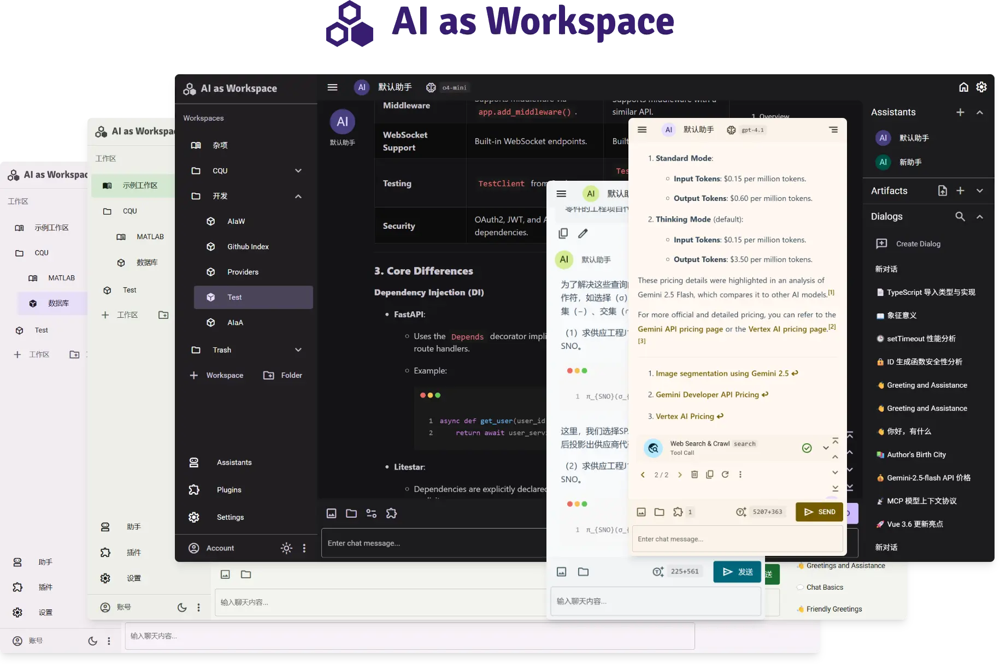
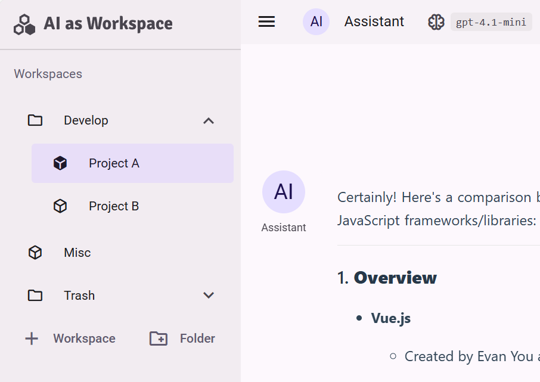
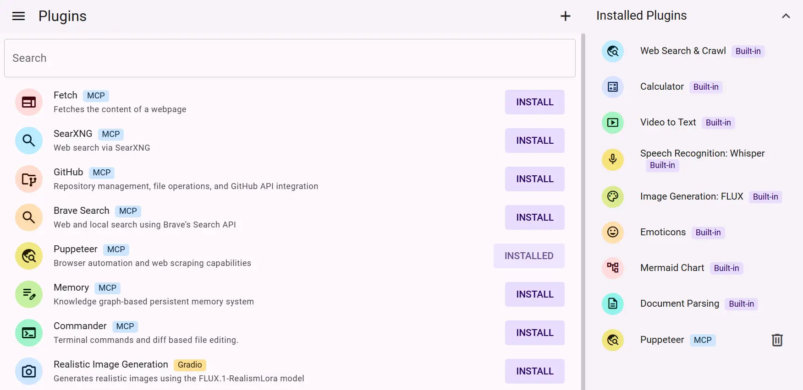

# AI as Workspace

 

An elegant AI client

[Web Version](https://aiaw.app) - [Download](https://github.com/NitroRCr/AIaW/releases/latest) - [Docs](https://docs.aiaw.app/) - [Self-hosting Guide](https://docs.aiaw.app/self-host/) - [简体中文](README.zh-CN.md)

## Features Overview

### Consistent Experience Across All Platforms

- Supported platforms: Windows, Linux, Mac OS, Android, Web (PWA)
- Multiple AI providers: OpenAI, Anthropic, Google, DeepSeek, xAI, Azure, etc.

### Conversation Interface

- User input preview
- Modifications and regenerations presented as branches
- Customizable keyboard shortcuts
- Quick scrolling to the beginning/end of a message


### Multiple Workspaces

- Create multiple workspaces to separate conversations by themes
- Group workspaces into folders; supports nesting
- Create multiple assistants within a workspace or global assistants



### Data Storage

- Data is stored locally first, accessible offline and loads instantly
- Cloud synchronization available after login for cross-device syncing
- Multi-window collaboration: open multiple tabs in the same browser with responsive data synchronization

### Design Details

- Support for text files (code, csv, etc.) as attachments; AI can see file contents and names without occupying display space
- For large text blocks, use Ctrl + V **outside the input box** to paste as an attachment; prevents large content from cluttering the display


- Quote content from previous messages to user inputs for targeted follow-up questions
- Select multiple lines of message text to copy the original Markdown


- Automatically wrap code pasted from VSCode in code blocks with language specification


### [MCP Protocol](https://docs.aiaw.app/usage/mcp.html)

- Support for MCP Tools, Prompts, Resources
- STDIO and SSE connection methods
- Install MCP-type plugins from the plugin marketplace or manually add MCP servers

### Web Search

- Web search based on SearXNG, ready to use out of the box.
- Also provides the functionality to crawl web content via URL.
- Supports concurrent search and concurrent crawling.

### [Artifacts](https://docs.aiaw.app/usage/artifacts.html)

- Convert any part of assistant responses into Artifacts
- User-editable with version control and code highlighting
- Control assistant read/write permissions for Artifacts
- Open multiple Artifacts simultaneously


### [Plugin System](https://docs.aiaw.app/usage/plugins.html)

- Built-in calculator, [document parsing, video parsing](https://docs.aiaw.app/usage/file-parse.html), image generation plugins
- Install additional plugins from the marketplace
- Configure Gradio applications as plugins; compatible with some LobeChat plugins
- Plugins are more than just tool calling



### Lightweight and High Performance

- Quick startup with no waiting
- Smooth conversation switching


### [Dynamic Prompts](https://docs.aiaw.app/usage/prompt-vars.html)

- Create prompt variables using template syntax for dynamic, reusable prompts
- Extract repetitive parts into workspace variables for prompt reusability


### Additional Features

Assistant marketplace, dark mode, customizable theme colors, and more

## LightHouse

| Desktop | Mobile |
| :-----: | :----: |
|  |  |

## Related Projects

- [New API](https://github.com/Calcium-Ion/new-api): AI model interface management and distribution system, supporting various large models with OpenAI-compatible format

## Install the dependencies
```bash
pnpm i
```

### Start the app in development mode (hot-code reloading, error reporting, etc.)
```bash
quasar dev
```

### Lint the files
```bash
pnpm lint
```

### Build the app for production
```bash
# SPA
quasar build

# PWA
quasar build -m pwa
```
