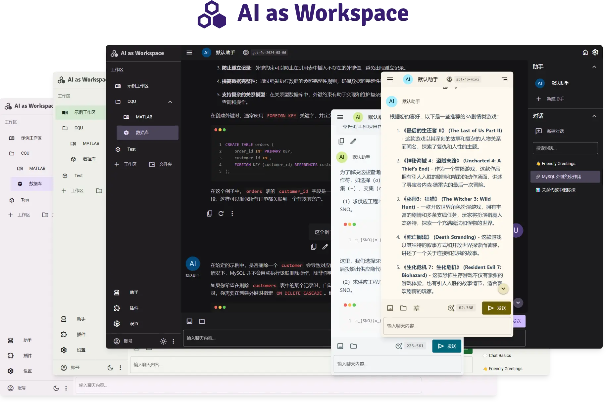

# AI as Workspace

 

更好的 AI 客户端

[网站链接](https://aiaw.app) - [下载客户端](https://github.com/NitroRCr/AIaW/releases/latest) - [使用文档](https://docs.aiaw.app/) - [自部署指南](https://docs.aiaw.app/self-host/)

## 功能概览

### 全平台一致体验

- 支持平台：Windows, Linux, Mac OS, Android, Web (PWA)
- 多服务商支持：OpenAI, Anthropic, Google, DeepSeek, xAI, Azure 等

### 对话页面

- 用户输入预览
- 修改提问、重新生成 以分叉的形式呈现
- 自定义键盘快捷键
- 对齐到消息开头/结尾的快速滚动


### 多工作区

- 创建多个工作区，将不同主题的对话分隔开
- 可将多个工作区放入一个文件夹中；支持嵌套
- 一个工作区中可创建多个助手，也可以创建全局助手


### 数据储存

- 数据首先储存在本地，无需加载且离线可浏览
- 登录后可使用云同步，跨设备实时同步
- 多窗口协同支持：同一浏览器打开多个标签，数据响应式同步

### 细节设计

- 支持将文本类型文件（代码、csv等）作为附件，AI 能看到文件内容和文件名；避免文件内容占据显示空间
- 对于大段的文本，可在**输入框外**使用 Ctrl + V 粘贴，也将作为附件；避免大段内容占据显示空间


- 可在用户输入中引用先前消息中的内容，方便对助手回答的部分内容针对性地追问
- 选中多行消息文本后，可直接复制 Markdown 原文


- 粘贴从 VSCode 复制的代码时，自动用代码块包裹，并标明语言


### [MCP 协议](https://docs.aiaw.app/usage/mcp.html)

- 支持 MCP Tools, Prompts, Resources
- 支持 STDIO 和 SSE 两种连接方式
- 可在插件市场安装 MCP 类型插件，或者手动添加 MCP 服务器

### 联网搜索

- 基于 SearXNG，开箱即用的联网搜索
- 同时提供通过 URL 爬取网页内容的功能
- 支持并发搜索和并发爬取

### [Artifacts](https://docs.aiaw.app/usage/artifacts.html)

- 可将助手回答的任意部分转为 Artifacts
- 用户可编辑，带版本控制，代码高亮
- 可控制助手对 Artifacts 的读写权限
- 可同时打开多个 Artifacts


### [插件系统](https://docs.aiaw.app/usage/plugins.html)

- 内置计算器、[文档解析、视频解析](https://docs.aiaw.app/usage/file-parse.html)、图像生成等插件
- 可在插件市场安装更多插件
- 可将 Gradio 应用配置为插件；兼容部分 LobeChat 插件；
- 插件不只是工具调用


### 轻量，高性能

- 启动迅速，无需等待
- 切换对话丝滑流畅


### [动态提示词](https://docs.aiaw.app/usage/prompt-vars.html)

- 通过创建提示词变量，使用模板语法，构建动态可复用的提示词
- 抽离提示词中的重复部分，放入工作区变量，实现提示词的复用


### 其他功能

助手市场、深色模式、自定义主题色等

## LightHouse

| Desktop | Mobile |
| :-----: | :----: |
|  |  |

## 相关项目

- [New API](https://github.com/Calcium-Ion/new-api): AI模型接口管理与分发系统，支持将多种大模型转为OpenAI格式调用

## Install the dependencies
```bash
pnpm i
```

### Start the app in development mode (hot-code reloading, error reporting, etc.)
```bash
quasar dev
```

### Lint the files
```bash
pnpm lint
```

### Build the app for production
```bash
# SPA
quasar build

# PWA
quasar build -m pwa
```
