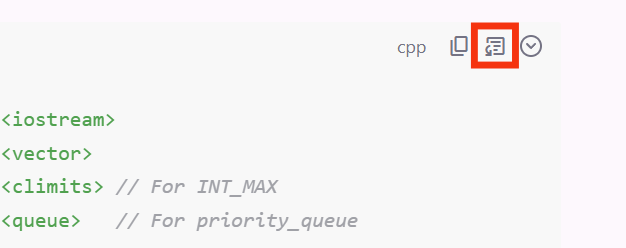

# Artifacts

Artifacts 最初是由 Anthropic 在 Claude 官网实现的功能。通过将助手回答中大段的独立内容（如代码、文章等）提取出来，作为「Artifacts」，显示在单独的窗口中，以便用户浏览、修改以及复用这些内容。

我们的 Aritfacts 功能在实现上有些差异，但作用是相似的，使用起来更通用，更可控。

## 创建 Artifacts

和 Claude 官网不同，AIaW 的 Artifacts 的创建主要是由用户控制的。你可以将助手回答中的任意部分转换为 Artifact。

对于代码块，可以点击右上角的按钮转换；

对于其他内容，通过选中多行文本后的菜单转换为 Artifacts。

此外，可以在右侧边栏手动创建或者上传本地文件。

我们也提供了自动提取 Artifacts 的选项，自动检测助手回答中是否有适合提取为 Artifacts 的内容，如果有，则自动提取并命名。不过这是通过额外请求系统助手实现的，并不影响当前助手的 prompt。

## 修改

打开 Artifacts 后，你可以直接修改 Artifacts 的内容，并在修改完成后按 Ctrl + S 保存修改。

Artifacts 有简单的版本控制，你可以在编辑页面左下角切换版本。

在编辑页面右下角，你可以控制助手对此 Artifact 的读写权限，默认是可读写的，你可以让助手修改 Artifacts 的内容。

助手只能看到打开的 Artifacts，你可以同时打开多个 Artifacts。当没有打开的 Artifacts 时，助手也不会收到 Artifacts 相关的 prompt，不会有额外的开销和影响。

## 范围

Artifacts 是存放在工作区一级的，这意味着它是跨对话的。同一 Artifact 在所属工作区的所有对话中都可用。也可以将 Artifact 移至别的工作区。

## 实现细节

尽管看起来很简单，但原版的 Artifacts 功能实际上是一个需要精调的功能，且很难提升其通用性。

首先，它并没有使用工具调用，而是通过让助手在回答中插入 `<antArtifact>` 标签来标识 Artifact。这意味着需要单独实现对流式响应的检测，无法和工具调用的逻辑通用。此外，最大的难点就在于让 AI 准确地判断是否应该使用 Artifacts。

根据 Claude 泄露的 prompt，Artifacts 的 prompt 有 4000+ tokens，并不简单。如果实现基本相同，是不是可以直接照搬这个 prompt？LobeChat 就是这样的，配合 Claude 模型使用，确实还可以。但同样的 prompt，换用 GPT 4o，就不行了，该用 Artifacts 的时候它不用，要明确提醒它才会用。明明 prompt 中并没有对模型的限定，但实际模型不同表现就是不同，只能理解为模型的差异性了。

这也是为什么我实现了一个不同的 Artifacts 功能：为了更通用、更可控。
