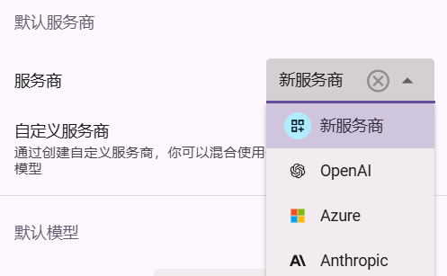

# 自定义服务商

如果你只想配置单个服务商/中转站，那么在设置页面选择服务商并配置 API Key 等设置即可。但如果想要同时配置多个服务商，对于不同的模型使用不同的服务商，就需要**创建自定义服务商**。

## 使用示例

考虑如图配置的自定义服务商：

其效果为：
- 对于 `gemini-2.0-flash` 和 `gemini-2.0-pro-exp` 模型，使用 Google 服务商
- 对于 `qwen-2.5-7b` 模型，使用 OpenAI 格式的服务商 `api.silliconflow.cn`，并将模型名重映射为 `Qwen/Qwen2.5-7B-Instruct`
- 对于其他模型，使用回落服务商（OpenAI 格式的 `api.aiaw.app`）

创建的自定义服务商将作为服务商的一个选项，你可以将其设置为默认服务商，或者特定助手的服务商

### 模型名重映射

在模型值中使用 `::` 实现模型名重映射。`::` 左边为你在对话/设置中使用的模型名，右边为实际请求使用的模型名。如 `qwen-2.5-7b::Qwen/Qwen2.5-7B-Instruct` 表示将 `qwen-2.5-7b` 映射为 `Qwen/Qwen2.5-7B-Instruct`
