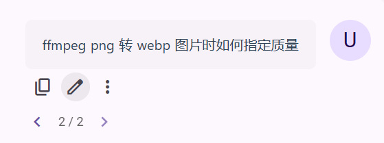
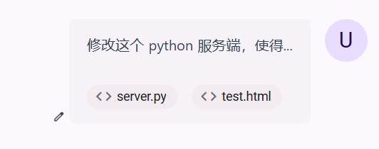
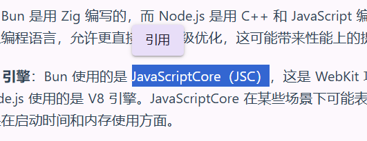

# Features Overview

## Basic Features

- Streaming, image uploading, LaTeX formulas... These basic features are naturally available, no need to mention them.

- [Cross-platform](cross-platform): Responsive interface design, adapted to screens of different sizes and proportions such as mobile phones and computers.

- Multi-provider support: Supports different providers such as OpenAI, Anthropic, and Google.

- Modify question, regenerate implemented in a forked form, like the official ChatGPT website (the entire conversation presents a "tree" structure)

- [File Parsing](file-parse): Supports uploading documents in formats such as Word, PDF, PPT, Excel, etc., and automatically parses them into text input.

- Video Parsing: Supports selecting video files and specifying a duration range (default is the entire video), which will be automatically transcribed into text input, thereby realizing the ability to ask questions about video content.

- [Plugin System](plugins): Built-in plugins such as web search, calculator and image generation. In addition, more plugins can be installed in the plugin store.

- Assistant Market: Get various customized prompt assistants (prompts from [lobe-chat-agents](https://github.com/lobehub/lobe-chat-agents))

- Local Priority + Real-time Cloud Synchronization: All data is stored locally, so there is no need to load and can be browsed offline. Log in to enable real-time cloud synchronization across devices (30-day trial, then $0.4/month).

- Model Service: In addition to configuring custom APIs, you can also log in to use our provided model service without configuration, supporting many advanced models such as gpt-4o, claude-3.5-sonnet, o1-mini, etc. Credit is charged at the original official API price as you use it and is permanently valid.

- Open Source: This application is open source, and all features are free except for the two services marked as paid above. You can also self-deploy this application.

- Excellent Performance: Fast startup speed, very smooth conversation switching.

- Interface Theme: Material 3 design style; supports dark/light mode; supports custom theme colors.

## Extended Use

- Multi-Workspace: In the left sidebar, you can create multiple workspaces to separate conversations with different themes and different types of assistants; you can also create folders to put multiple workspaces into them; supports nesting.

- [Artifacts](artifacts): Any part of the assistant's response can be converted into Artifacts, which will be displayed in a separate window for easy modification and reuse.

- [Prompt Variables](prompt-vars): In addition to setting ordinary static prompts in the assistant's "Role Setting", you can construct dynamic and reusable prompts by creating prompt variables and editing prompt templates.

- Plugin Extensibility: Supports configuring any Gradio application as a plugin, and is also compatible with some LobeChat plugins; plugins not only provide tool calls, but also file parsing functions can be extended through plugins; tool calls support multimodal results.

## Detail Design

- User Input Preview: Provides a real-time preview of the content being entered; inspired by NextChat.

- Code Paste Optimization: When pasting code copied from VSCode into the input box, it is automatically wrapped in a markdown code block and the language is indicated.

- Text File Support: Supports directly adding text-type files (code, CSV, etc.) to the user input, and the file content and file name will be part of the user input. Compared to manually pasting the file content into the input box, this method is faster and the file content does not take up display space.

- Paste: Through Ctrl + V paste, you can paste text, images, and files; in addition, when pasting text outside the input box, it will be used as an independent text block, like a text file.

- Quote: After dragging and selecting the content of the conversation message with the mouse, click "Quote" to quote the content in the user input. This function is equivalent to a shortcut to manually copy the message content and paste it into the input box, which is convenient for asking targeted follow-up questions about part of the assistant's answer.

- Quick Scroll: There is a quick scroll button in the lower right corner of the conversation. In addition to general scrolling to the top/bottom, the middle two buttons are for scrolling aligned to the beginning/end of the message or the previous/next message, which is very convenient when the message is long.

- Keyboard Control: Keyboard control: Supports setting keyboard shortcuts to trigger the above scrolling operations, as well as using keyboard shortcuts to switch message chains, regenerate, and create new conversations.
