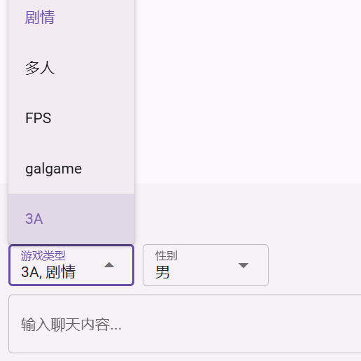

# Prompt Variables

General prompts are static text. You can set ordinary static prompts in the "Role Setting" of the assistant.

In addition, AIaW also supports building **dynamic** and **reusable** prompts by creating prompt variables and editing prompt templates.

In the "Prompt Variables" section of the assistant, you can define prompt variables.

These variables can be used in "Prompt Templates"; their values will be selected/entered by the user during the conversation.

## Defining Variables

"Variable Name" is the name used when using the variable in the prompt template; "Label" is the label of the variable value input box during the conversation.

The correspondence between the variable "Type" and JS data types is as follows:
- Text: string
- Number: number
- Switch: boolean
- Select: string
- Multiple Select: array

## Syntax Rules

The prompt template is rendered using the [LiquidJS](https://liquidjs.com/) template engine. Please refer to the [LiquidJS documentation](https://liquidjs.com/zh-cn/tutorials/intro-to-liquid.html) for syntax rules.

It is worth noting that we have enabled `jsTruthy` in the engine options, which means that the judgment of true/false values is based on JavaScript rules rather than Shopify rules. For example, the truth value of an empty string is false. See [here](https://liquidjs.com/tutorials/truthy-and-falsy.html) for details.

::: tip "Rendering"
Although prompts are not meant to be "displayed", we still call the process of using the template engine to process prompt templates and variables "rendering" because it uses the same method as traditional HTML rendering.
:::

## Built-in Variables

This is the default content of the prompt template:

