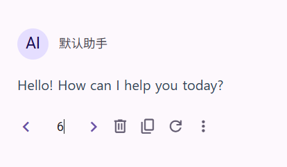

# Usage Tips

## Pasting Large Text Blocks

When pasting text using Ctrl + V **outside the text box**, the text will be added as an attachment to the input. Text pasted in this way will not occupy display space.

## Creating Conversations on Mobile

On mobile devices, you can quickly create a new conversation by long-pressing the icon in the top right corner. (This feature is currently not supported in Safari browser due to compatibility issues.)

## Switching to a Specific Branch

The branch switching component supports directly entering the number of the branch you want to switch to, and then pressing Enter to switch.

## Editing Model List

When editing the model list, you can enter any value and then press Enter to add the entered value, instead of just selecting from the list.

## Checking the Version

You can check the current version by clicking the Logo at the top of the left sidebar.