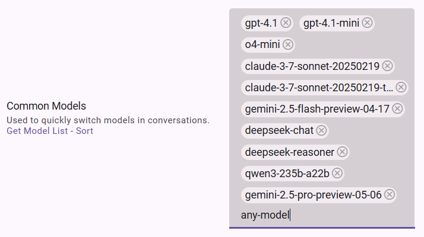

# 使用技巧

## 粘贴大段文本

在**文本框外**使用 Ctrl + V 粘贴文本时，文本将作为附件添加到输入中。这样粘贴的文本将不会占据显示空间。

## 移动端创建对话

在移动端，可通过长按右上角图标快捷创建新对话。（Safari 浏览器由于兼容性问题暂不支持）

## 切换到指定分支

分支切换组件支持直接输入要切换到第几个分支，然后按回车切换。

## 编辑模型列表

编辑模型列表时，可以输入任意值，然后按回车添加已输入的值，而不只是从列表中选择。

## 检查版本

可通过点击左侧边栏顶部的 Logo 来查看当前的版本。
